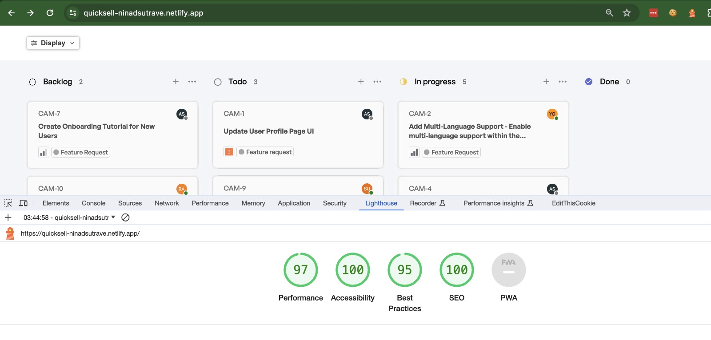
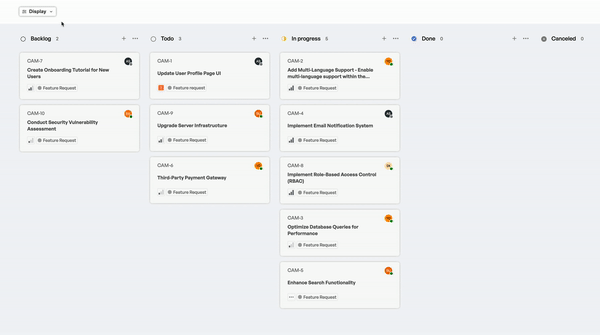
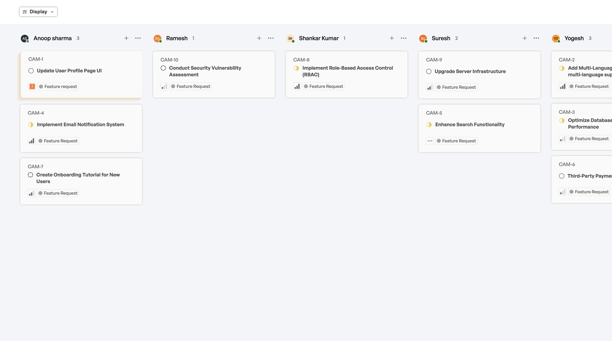
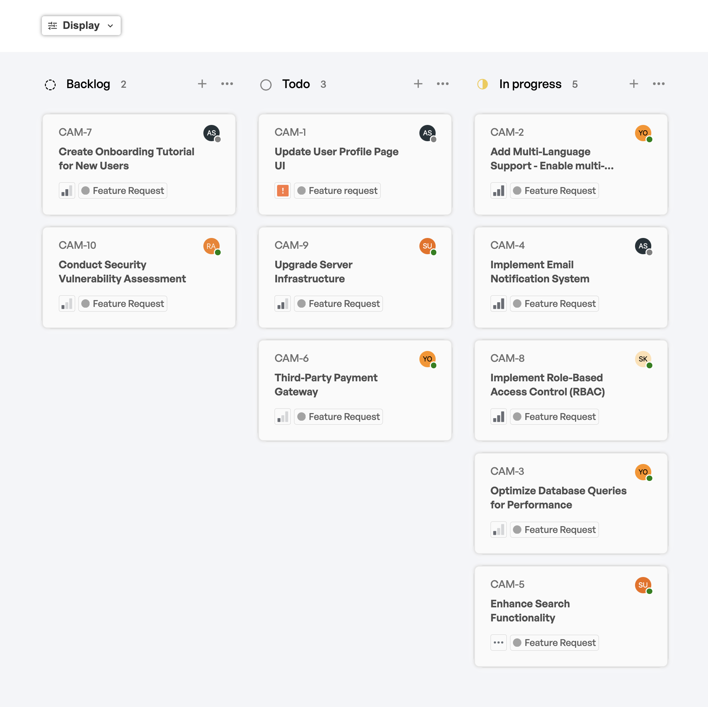
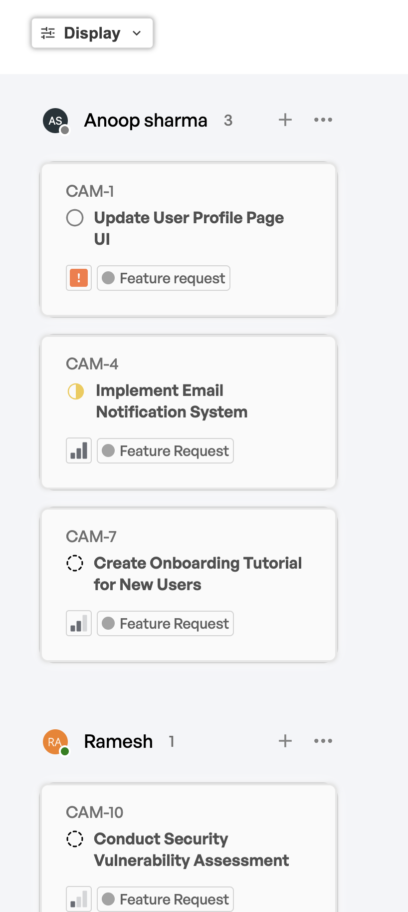

<h1 align="center">QuickSell Frontend Assignment</h1>

# Task
A task tracking application featuring a Kanban style Dashboard

https://quicksell.notion.site/Frontend-assignment-fa2f7f8aaada4099916994bad6ec70c2

## Details
Name: Ninad Sutrave

Institute: IIT Ropar

Entry Number: 2019MED1010

Portfolio: [ninadsutrave.in](https://ninadsutrave.in)

Email: 2019med1010@iitrpr.ac.in

## Lighthouse Report

The website has received a 'near perfect' score on Lighthouse.

 

## Features

✓ Easy tracking of pending work by subordinates/employees/team

✓ Distribute tasks by employee name, status and priority

✓ Sort on the basis of task or priority

✓ Sophisticated UI and easy to use

✓ Responsive on all devices

## Dependencies Used
 - **[Axios](https://www.npmjs.com/package/axios)**

 For fetching APIs

 - **[React Icons](https://www.npmjs.com/package/react-icons)**:

 For necesssary icons in the UI

 - **[Prop Types](https://www.npmjs.com/package/prop-types)**:

 For specifying prop types passed

 ## APIs used

 - **[QuickSell API](https://api.quicksell.co/v1/internal/frontend-assignment)**

To fetch ticket and user information

 - **[UI Avatars](https://ui-avatars.com)**

 To generate avatar icon for each user

 ## Preview

 

 ### Laptop

 

 ### Tablet

  

 ### Mobile
  

## Installation

Here is a step by step guide to set this project up on your local environment!

**1. Clone the Repository**

Open a terminal or command prompt and navigate to the directory where you want to clone the repository. 

Run the following command

Using HTTPS

    $ https://github.com/ninadsutrave/QuickSellAssignment.git

**OR**

Using SSH

    $ git clone git@github.com:ninadsutrave/QuickSellAssignment.git

**2. Navigate to the Project Directory**

Change your working directory to the project folder. 

Run the following command

    $ cd QuickSellAssignment

**3. Install Dependencies**

Inside the project folder, install the required dependencies using npm. 

Run the following command

    $ npm install

**4. Run the Development Server**

Start the development server to run the React application locally. 

Run the following command

    $ npm run dev

